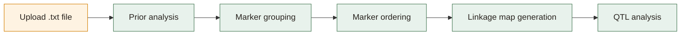

# Linkmapper

<!-- FILL: replace placeholder URLs with actual repo and R-universe URLs once known -->

[](https://opensource.org/licenses/MIT)
[](https://cran.r-project.org/)
[](https://shiny.posit.co/)
[]()

Linkmapper is a free, open-source Shiny web application that provides a graphical
user interface for linkage mapping and QTL visualisation, built on the
[onemap](https://cran.r-project.org/package=onemap) R package. It is designed for
students and researchers working with biparental mapping populations (currently F2
intercrosses and backcrosses) who want to perform linkage mapping without writing
R code. Linkmapper is available as a hosted web app and as an installable R package.

---

## Features

- Five-step guided workflow with step-locking (steps unlock only when prerequisites
  are complete)
- Prior analysis: missing data visualisation and segregation distortion testing
- Marker grouping using LOD thresholds and maximum recombination frequency
- Three marker ordering algorithms: RECORD, RCD, and UG (unidirectional)
- Interactive linkage map output (plotly) and static PNG download
- QTL scanning with interval mapping (IM) and composite interval mapping (CIM)
- Downloadable results at every step (tables, plots, maps)
- No R knowledge required to use the hosted app
- Available as a hosted web app (ShinyApps.io) and as an R package for local use

---

## Workflow



---

## Supported population types

| Population type | Status |
|---|---|
| F2 intercross | Supported |
| Backcross | Supported |
| RILs | Planned |
| Outcrossing populations | Planned |
| Polyploids | Planned |

---

## Data format

Linkmapper accepts genotype data in MAPMAKER `.txt` format. The file must begin with
a header line declaring the data type, number of individuals, number of markers, and
number of phenotype columns:

```
data type f2 intercross
188 62 2
```

Genotype data follows in standard MAPMAKER encoding (`A`, `B`, `H` for F2; `A`, `B`
for backcross; `-` for missing). Phenotype columns are optional but are required for
QTL analysis. A demo dataset (188 individuals, 62 markers, 2 phenotypes, F2
intercross) is bundled with the package and available from within the app.

---

## Quick start

### Hosted web app

Visit <!-- FILL: add ShinyApps.io URL --> — no installation required.

### R package (local)

```r
# Install from R-universe
install.packages("linkmapper",
  repos = "https://ebenogoe.r-universe.dev"
)

# Launch the app
linkmapper::run_linkmapper()
```

---

## Package structure

```
linkmapper/                    # Package root (lowercase for CRAN)
├── DESCRIPTION
├── NAMESPACE
├── LICENSE
├── README.md
├── R/
│   ├── run_app.R              # run_linkmapper() — launches the Shiny app
│   ├── read_data.R            # validate_mapmaker_file(), read_f2_data()
│   ├── analysis.R             # prior_analysis_lm(), suggest_lod_lm()
│   ├── grouping.R             # group_markers(), twopts_analysis()
│   ├── ordering.R             # order_linkage_group()
│   ├── mapping.R              # generate_linkage_map(), draw_interactive_map()
│   └── utils.R                # Shared helpers
├── inst/
│   └── app/                   # The Shiny app lives here
│       ├── app.R
│       └── www/
├── tests/
│   └── testthat/
├── vignettes/
│   └── linkmapper-workflow.Rmd
├── data/                      # Built-in demo dataset
│   └── f2_demo.rda
└── man/                       # Auto-generated by roxygen2
```

---

## Citation

<!-- FILL: add citation once published -->

```
Ogoe, E., Obeng, M., Amoako, B. S., & Kena, A. W. (in preparation).
Linkmapper: a web application for linkage mapping and QTL visualisation.
The Plant Genome.
```

---

## Dependencies

| Package | Role |
|---|---|
| shiny | Core web application framework |
| bslib | Bootstrap 5 UI components and theming |
| shinyjs | JavaScript interactions (enable/disable UI elements) |
| waiter | Loading spinners for long-running operations |
| onemap | Linkage mapping engine (two-point analysis, grouping, ordering, map estimation) |
| qtl | QTL scanning (interval mapping and CIM) |
| ggplot2 | Static plot generation |
| plotly | Interactive linkage map output |
| bsicons | Bootstrap icons for the UI |

---

## License

MIT — see [LICENSE](LICENSE) for details.

---

## Acknowledgements

Linkmapper was developed as a final-year undergraduate dissertation project at the
Kwame Nkrumah University of Science and Technology (KNUST), Kumasi, Ghana, within
the Department of Crop and Soil Sciences, Faculty of Agriculture. The authors thank
Dr. Alexander W. Kena for supervision and guidance throughout the project.
